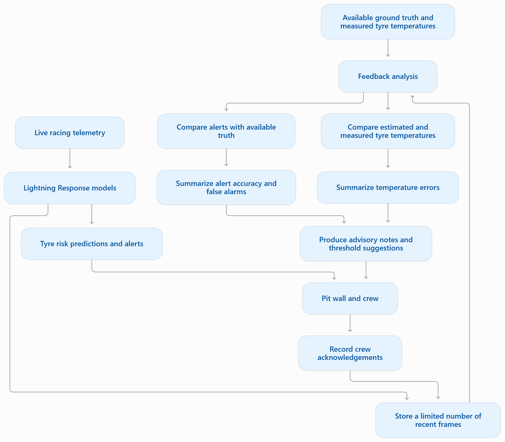

# Lightning Response: AI tyre-safety pit wall

**FormulaTech Hacks: Track 1 (Safety Diagnosis) · Ollon (Data-Driven Motorsport Safety) · Ampere (AI for Motorsport Safety)**

Lightning Response watches every tyre on a race car, predicts trouble before it happens, explains why, and tells the
pit wall what to do: **OK, MANAGE, BOX THIS LAP or BOX NOW**.

Since 2022 every F1 car has carried a standard FIA tyre-pressure sensor, but there is no public analytics layer that
*predicts* tyre failure. Tyres keep causing dangerous incidents:
- **Baku 2021:** Verstappen and Stroll had rear-tyre failures at around 300 km/h.
- **Silverstone 2020:** three front-left failures in the final laps.
- **Qatar 2023:** kerbs caused sidewall damage, and the FIA imposed an emergency 18-lap limit per set.
- **Nürburgring 2005:** a flat spot vibrated a suspension to failure.

- [Product overview (PDF)](./How%20SIDEWALL%20works.pdf)
- [Pit wall design concept (PDF)](./SIDEWALL%20clearer%20pit%20wall%20concept.pdf)

## What it does
- **Predicts** lock-ups and wheelspin about a second ahead, and detects overheating, cold tyres, flat spots and air loss.
- **Explains** every risk: a calibrated probability, the cause (braking, throttle, speed and cornering, engine and
  gearing, tyre heat, pressure), how much of the tyres' grip is in use, and a plain-language fix.
- **Forecasts tyre life:** laps until the performance cliff, with a "safe laps left" promise calibrated to hold 90% of
  the time.
- **Acts:** one health score (0–100) per tyre and one pit call, read out as a radio message.
- **Proves it on real races:** replays of Silverstone 2020 and Baku 2021 with models that never saw those seasons,
  including the moment each tyre really failed.
- **Lets judges drive:** a phone becomes the pedals of a live simulated car; four scenario buttons force a lock-up,
  wheelspin, a pressure leak or overheating so the pit wall can be seen catching each one.
- **Warns the driver directly:** when lock-up or wheelspin risk is high, the phone shows a warning with the action to
  take; when it is imminent, it says BRACE.

## How it maps to the tracks
| Track | What Lightning Response shows |
|---|---|
| **Track 1: Safety Diagnosis** | Real-time per-tyre health (0–100) and an escalating pit call. Lock-up and wheelspin warnings come 0.5–1.75 s early, and the safe-laps bound is ready before the cliff arrives. Silverstone 2020 is called BOX 15 laps before the real failure. |
| **Ollon: data-driven** | Six seasons of public F1 data (2018–2021, 2024–2025: 127 races, 4,990 stints, 138,683 laps) turned into a tyre-safety dataset, and a **data-driven stint limit for 33 circuits**: the Qatar rule, set before anything breaks. |
| **Ampere: AI** | Calibrated, explained early-warning models trained on sim ground truth and run on real F1 telemetry, a virtual tyre sensor, and survival models with a conformally calibrated safe-laps bound. |
| **TELUS: connected (bonus)** | The driver's phone is the car's pedals, over any network through a Cloudflare tunnel. |

## Quick start
The repository already contains the trained models and the demo replays, so the app runs without downloading data.

**1. Install** (Python 3.12+; `uv` pins 3.13):

```bash
uv sync
```

Without `uv`:

```bash
python -m venv .venv
.venv/Scripts/python -m pip install -r requirements.txt
```

On macOS/Linux, replace `.venv/Scripts/python` with `.venv/bin/python`.

**2. Run** everything (web app, APIs, WebSockets, live simulator) in one process on port 8000:

```bash
uv run python -m sidewall.server.app
```

**3. Open** http://localhost:8000.

| Page | What it is |
|---|---|
| `/` | Home: choose a replay, the live simulator or the data |
| `/pitwall?mode=replay` | Replay a real race (Silverstone 2020, Baku 2021) |
| `/pitwall?mode=live` | Drive it yourself: the live simulator, driven from a phone |
| `/driver` | The phone controller: brake and throttle, BOX, scenario buttons, risk alerts |
| `/atlas` | Explore the data: circuits, stint limits, survival curves, degradation, model scorecard and metrics plots |
| `/crew` | Pit-crew phone view (no longer linked from the pit wall) |
| `/docs` | FastAPI API docs |

### Phones on any network (Cloudflare tunnel)
Phones normally reach the laptop over the local Wi-Fi, which fails on networks that block device-to-device traffic
(eduroam, most venue Wi-Fi) and breaks whenever the laptop reconnects. A Cloudflare quick tunnel gives the server a
public `https://…trycloudflare.com` address instead, and the QR codes use it automatically:

```bash
winget install --id Cloudflare.cloudflared      # once
python -m sidewall.server.app --tunnel          # or set SIDEWALL_TUNNEL=1
```

The address appears in the console after a few seconds and changes on every start; the pit wall's QR code picks it up
by itself (it is never cached, and re-checked every 10 s while the Driver phone panel is open). Without the tunnel,
the QR code falls back to the laptop's local-network address. `SIDEWALL_PUBLIC_URL` overrides both.

## The pit wall
- **Banner:** the one call the crew needs (OK, MANAGE, BOX THIS LAP, BOX NOW), with its reasons and the radio message.
  Level 1 is called ADVISE in the engine and on the phones.
  It switches to **CRASH** or **TYRE FAILURE** when that happens.
- **Tyres:** a top-down drawing of the car with each tyre's tile beside its own wheel. Each wheel glows in its tyre's
  temperature colour (blue cold, green in the grip window, yellow hot, red overheating) and flashes when the tyre is
  flagged for a flat spot, air loss or deflation. Replays show *AI estimates*; the live car shows *tyre sensors*.
- **Track map:** the car (a hand-drawn sprite pointing along its direction of travel) on the real circuit, with a glow
  in the call colour, pins for lock-ups, wheelspin and raised calls, and a burst where a crash happened.
- **Risk, next second:** lock-up and wheelspin probability, grip in use, the causes with measured evidence, and advice.
  Each box is outlined by alert level:

  | Colour | When | Label |
  |---|---|---|
  | Red, pulsing | live: BRACE sent to the driver; replay: the event is happening, or risk ≥ 30% | BRACE · SENT TO DRIVER / HAPPENING / HIGH RISK |
  | Red | live: a warning sent to the driver | WARNING · SENT TO DRIVER |
  | Orange | a pit stop is called (BOX THIS LAP or BOX NOW) | PIT STOP CALLED |
  | Yellow | risk ≥ 10%, or raised over the last few corners | WATCH |

  In live mode a strip above the boxes shows exactly what the driver's phone is showing ("📱 Driver sees: …").

- **Tyre life:** safe laps left (90% confidence) and the likely laps to the cliff.
- **Log:** every call change, event, driver alert, scenario result and crash, with time stamps.

## Replays: real races the models never saw
| Replay | Real outcome | What the pit wall does |
|---|---|---|
| British GP 2020, Hamilton, laps 20–52 | Front-left failure on the last lap; limped home on three wheels and won | BOX THIS LAP from lap 37, held to the failure on lap 52. At the failure moment the banner shows **TYRE FAILURE** and the car carries on at reduced speed, as in the telemetry. |
| Azerbaijan GP 2021, Verstappen, laps 14–46 | Left-rear failure at over 300 km/h on lap 46; crashed out of the lead | BOX by lap 28. At the failure moment the banner shows **CRASH** and the car stops, as in the telemetry. The call names the front-right tyre, not the left-rear: the real cause (running pressure) is not visible in public data. |

- Each replay uses tyre-life models **retrained without that race's season**, so the race is genuinely unseen.
- Everything on screen uses only data available up to that moment.
- The failure moment is found in the telemetry itself (`replay.failure_event`): the first point on the failure lap
  where the car is at least 30% slower than on the previous lap at the same place for 3 s. If it then stops within
  10 s, it is shown as a crash; otherwise as a tyre failure.
- Key-moment buttons jump to the first MANAGE, first BOX and the real failure.

## Drive it yourself: the live simulator
The live car runs on the Silverstone racing line from a real F1 lap, with a physics tyre model: 3 thermal nodes per
tyre (tread surface, carcass, inflation gas), grip that depends on temperature, pressure, wear and downforce,
pressure from the gas law, and the sensors a real car carries (infrared tread, TPMS, wheel speed, a hub accelerometer
for flat-spot vibration). Physics runs at 20 Hz; the full monitoring stack analyses it 4 times a second, starting as
soon as each new 4 Hz data frame exists (about 140 ms per run, and the physics stays in real time). The autopilot keeps
its throttle within the rear tyres' grip, so tidy driving has no wheelspin.

1. Open `/pitwall?mode=live`, press **📱 Driver phone** and scan the QR code.
2. On the phone, tap **Take the wheel**: brake on the left, throttle on the right; steering is automatic.
   **BOX** fits fresh tyres.
3. The pit wall has **💥 Debris** (starts a slow puncture on a random tyre) and **↺ New tyres**.

### Scenario buttons
The phone's four scenario buttons drive the car through scripts from `simulator/scenarios.json` (shared with the
browser simulator and the backend tests). The script takes the pedals; a script's `steer` becomes a virtual corner.
Tap the lit button again to stop early; afterwards the phone keeps the wheel.

| Button | Script | What happens | Result seen in testing |
|---|---|---|---|
| Lock-up | `lockup` | Three braking zones, each later; the last stamps on the brakes | Warned on the near-limit zone; lock-up caught within 0.2 s |
| Wheelspin | `wheelspin` | Three hairpin exits, each harder; the last floors it from a standstill | Warned on the approach; wheelspin caught within 0.2 s |
| Tyre Overheating | `corner` | Fast corners, then a long tight one past the limit | Warned about 0.2 s before the tread passed 125 °C |
| Tyre Pressure Anomaly | `puncture` | Debris cuts a random tyre, which leaks while the car keeps racing | Air loss detected about 1.6 s after the cut |

When a scenario ends, a watcher (`sidewall/sources/scenarios.py`) times the pit wall's warning against the simulator's
own record of when the hazard happened, and the phone and the pit-wall log show, e.g., *"SIDEWALL warned 0.2 s before
the overheating. It also warned 1 time on the approach."* The lead time is measured from the warning that runs into
the hazard, so an earlier unrelated warning can't inflate it; a miss is reported as a miss.

### Driver alerts
The phone is warned directly from the next-second risk, as soon as each analysis finishes:

| Level | Lock-up | Wheelspin | Phone shows |
|---|---|---|---|
| Warning (high chance: counteract) | risk ≥ 30% | risk ≥ 80% | amber "⚠ LOCK-UP RISK / Ease off the brake" (or throttle), short buzz |
| Brace (imminent, or happening) | risk ≥ 50%, or a lock-up is detected | risk ≥ 95%, or wheelspin is detected | red, pulsing "‼ … IMMINENT / BRACE", red screen border, three long buzzes |

Thresholds are per event, set on this simulator so tidy driving rarely triggers them; an alert stays up at least 1 s,
and none are shown while the car is crashed (`ALERT_P` in `sidewall/sources/live.py`). Measured on the current build:
in the lock-up scenario the driver is warned about 4 s before the lock-up (on the near-limit braking zone), and BRACE
reaches the phone about 0.3 s after wheelspin starts and about 0.4 s after a lock-up starts. Over 150 s of tidy
driving there are no wheelspin alerts and about 4 lock-up warnings.

In held-out testing (section below) the models warn a median **0.5 s before a lock-up and 1.75 s before wheelspin**. The
scenario scripts end in instantaneous inputs (stamping on the brakes, flooring it), which nothing can predict, so in the
live demo the real early warning is the one on the approach.

### Crashes
The car crashes and stops dead when it goes **off the track** (too fast for a corner, beyond the slide limit) or a
**tyre fails** (a tyre that has lost 40% of its air, above 80 km/h). The pit wall shows CRASH with the reason and a
countdown, the phone shows CRASHED and vibrates, a running scenario stops, and after 8 s the car is recovered to the
pits on fresh tyres. Tidy driving and the scenarios never crash.

## How the prediction works
```
car data (4×/s) ─┬─> virtual tyre sensor ──────────> temperature + pressure per tyre
                 ├─> lock-up / wheelspin model ───> calibrated % + cause + advice
                 ├─> air-loss and flat-spot detectors (physics)
                 └─> lap data ──> tyre-life survival models ──> safe laps left
                                          │
              all of it ──> tyre health 0–100 ──> OK / MANAGE / BOX ──> banner, radio, phones
```

### Models (all trained on existing public datasets)
| Model | Data | Held-out result |
|---|---|---|
| Lock-up early warning | Assetto Corsa Gym, Dallara F317, 116 human stints, per-wheel slip ratio as ground truth | ROC-AUC 0.96 on unseen drivers, 0.90 on an unseen track, 0.90 on a different car. 85% caught, median 0.5 s early |
| Wheelspin early warning | same | ROC-AUC 0.98 / 0.96 / 0.93. 99% caught, median 1.75 s early |
| Overheating / cold tyre | same | Overheating 0.89 (0.70 on an unseen track, so the dashboard leans on the virtual TPMS). Cold tyre 0.99 |
| Virtual TPMS (core and surface temperature per tyre, pressure via the gas law) | same | Unseen track: 5.9–9.4 °C error against 10.9–14.2 °C for a naive baseline; pressure within 0.98 psi |
| Cliff hazard + safe laps left | FastF1 real races (train 2018–21 + 2024 R1–12, calibrate 2024 R13–24, test all of 2025) | Cliff ROC-AUC **0.87 on unseen 2025** (train 0.92, overfit gap 0.05). The conformal safe-laps bound is breached **7.3%** of the time on 2025 (target ≤ 10%; 15% without calibration) |
| Tyre failure hazard | FastF1 + Jolpica retirements + detected lap-time spikes | ROC-AUC 0.82 on 2025, but only 5 failures there, so it's noisy; race-grouped CV 0.68 is the more honest number |
| Slow puncture / deflation | physics: gas-mass invariant P_abs/T_abs + CUSUM | Synthetic tests: a leak is caught while the tyre warms, before raw pressure moves; heat cycles never trigger it |
| Flat spot | locked-sliding distance + once-per-revolution vibration (order tracking) | Synthetic tests pass; there are no false alarms on pure noise |

The trained files, their sizes, checksums and rebuild commands are listed in the
[model card](./models/weights/README.md). Each has a `*_metrics.json` beside it, and the Atlas plots them
(`/api/metric-plots`).

The **feature contract** (`sidewall/features.py`) is what takes the models from sim to real: they only ever see what a
public F1 feed contains (speed, throttle, an on/off brake flag, gear, RPM and position, all at 4 Hz). Sim data is
degraded to look like that. Accelerations rebuilt from position match the sim's own accelerometer with correlations of
0.97 (lateral) and 0.91 (longitudinal).

### Lock-up and wheelspin risk: predictive, calibrated, explained
1. **Stage 1: telemetry pattern.** LightGBM on the shared features, trained without class re-weighting so its output
   is a real probability. On held-out driver sessions the calibration error is 0.2%: a "20%" leads to the event about
   1 time in 5. TreeSHAP splits each prediction into **Braking**, **Throttle**, **Speed & cornering**, **Engine &
   gearing** and **Tyre heat history**. The Atlas view also summarizes those same families as a grouped
   Stage-1 LightGBM gain plot, so the AUC cards sit next to a compact view of which telemetry factors drive lock-up
   versus wheelspin risk.
2. **Stage 2: demand vs grip, per car.** A logistic regression adds driver demand and measured tyre condition (tread
   outside the 85–115 °C window, pressure off target). On the live simulator car, fronts 10 °C above the window multiply
   lock-up odds ×11, hot rears (10 °C over) multiply wheelspin odds ×5.7, and each psi of low rear pressure multiplies
   wheelspin odds ×1.3 (lock-up ROC-AUC 0.62 → 0.78 and calibration error 20% → 3.5%; wheelspin 0.84 → 0.90 and
   17% → 1.9%). Recalibrate with `python -m sidewall.models.risk --sim-only`, which leaves the Assetto Corsa models as
   they are. On the Assetto Corsa data, tyre temperature adds
   almost nothing, and we report that as found.
3. **Prevention.** The factor that dominated over the last few corners becomes an instruction, e.g. "More throttle
   than the rears can put down: short-shift out of slow corners". Sustained risk raises a MANAGE call.

`python -m sidewall.models.risk` trains both stages and writes `models/weights/risk_metrics.json`.

### Tyre health and the pit call
Each tyre's health (0–100) combines wear, cliff and failure risk, overheating, cold, air loss, flat spot and abuse, with
bigger dangers taking bigger bites. It falls fast (about 2 s) and recovers slowly (about 20 s) so it doesn't flicker.
Alert thresholds are the top 5% and 1% of training laps, not tuned to the demo races.

### Guarding against overfitting (tyre life)
The first version memorised races: training ROC-AUC 0.997 against 0.85 on held-out seasons; weather columns alone
scored 0.90 on training and 0.51 on test, because they identify individual races
(`python -m sidewall.models.diagnostics` reproduces this). The fixes:
- **Causal features only.** The degradation trend is refitted each lap from completed laps.
- **No race fingerprints.** Air temperature and humidity are dropped; track temperature is coarsened to 5 °C bands.
- **Out-of-season circuit priors.** A training row never sees statistics that include its own stint.
- **Cleaner labels.** Yellow-flag laps are not "clean", and a "cliff" shared by 3+ drivers on the same lap is dropped.
- **Monotone constraints and model size chosen by race-grouped cross-validation.**
- **Time-ordered, non-overlapping splits** (train, calibrate, test), checked in code by `assert_no_overlap`.

Result: the train–test gap fell from about 0.15 to 0.05 (cliff) and from about 0.35 to 0.09 (laps-to-cliff), with test
accuracy the same or better.

## Tech stack
**Backend**
- Python (3.11 minimum; developed on 3.12, `uv` targets 3.13), FastAPI, Uvicorn
- WebSockets connect the pit wall, the driver phone and the crew phone
- No database or login: live state is in memory, heavy work (replay rebuilds, feedback) runs on a small in-process job
  queue (`sidewall/server/jobs.py`), and the feedback loop saves its state to a local JSON file
- `qrcode` generates the QR codes that open the pages on phones
- Optional Cloudflare quick tunnel (`cloudflared`) gives phones a public `https://` address

**Frontend**
- Plain HTML, CSS and JavaScript: no framework and no build step
- Canvas 2D and SVG draw the track map, the car, the speedometer and the charts
- Browser APIs: Vibration (driver alerts, crashes, lock-ups), Web Speech (the radio call read aloud), Wake Lock and
  Fullscreen (driver phone), Pointer Events (the pedals)
- Google Fonts: Inter and JetBrains Mono

**Machine learning and data**
- pandas, NumPy, SciPy (Savitzky–Golay smoothing of the racing line) and PyArrow (Parquet files)
- LightGBM, with monotone constraints, quantile models and built-in TreeSHAP explanations, for tyre life and lock-up /
  wheelspin risk
- scikit-learn: logistic regression (per-car risk calibration) and race-grouped cross-validation
- Conformal calibration for the safe-laps bound
- joblib stores the trained models (`models/weights/`)
- Physics models: the gas law for the virtual tyre-pressure sensor, a CUSUM leak detector, and a tyre and car
  simulator

**Data sources**
- FastF1 / OpenF1: real F1 lap, tyre, weather and telemetry data (2018–2021 and 2024–2025)
- Jolpica / Ergast: retirements, used as tyre-failure labels
- Assetto Corsa Gym (Hugging Face): simulator data with per-wheel slip, used as ground truth
- THULab Spa telemetry: an external car for testing the early warnings
- Kaggle F1 tyre-strategy datasets

**Tooling**
- pytest for tests
- `uv` for Python dependencies (`pyproject.toml`, `uv.lock`)
- Git and GitHub

## Repository layout
```
sidewall/                 the full-stack app
  server/app.py           FastAPI: pages, APIs, WebSockets, live session, QR codes
  server/tunnel.py        optional Cloudflare quick tunnel for phones
  server/feedback.py      runtime feedback loop (see below)
  server/jobs.py          background jobs (replay rebuilds, feedback)
  sources/sim.py          live simulator physics, sensors and crashes
  sources/live.py         live session: 20 Hz physics, 4 Hz analysis, driver control and alerts
  sources/scenarios.py    scenario-button scripts and the warning-lead watcher
  sources/replay.py       real-race replays and failure detection
  engine/monitor.py       runs every model on a stream and fuses them into frames
  engine/health.py        tyre health index and pit call
  models/                 event detectors, risk, grip, flat spot, tyre life, labels, diagnostics
  twin/                   virtual TPMS and gas-law pressure / leak detection
  data/                   FastF1 and Assetto Corsa ingest, stints, atlas
web/                      pit wall, driver phone, crew phone, atlas, home page, images
models/weights/           trained models + metrics + model card
simulator/                browser simulator and scenarios.json (shared scripts)
backend/, dashboard/      lower-level simulator pipeline (see below)
training/                 laps-remaining model for the lower-level backend
datasets/                 dataset extraction and TyreFrame normalisation
tests/, backend/tests/    test suites
```

## API
| Route | Purpose |
|---|---|
| `GET /health`, `GET /api/model/status` | Service health; model path, source, metrics and evidence limits |
| `GET /api/scenarios`, `GET /api/replay/{key}` | Replay list; frames, track and failure event for one replay |
| `POST /api/predict/laps` | Estimated laps remaining for one compound / age / track-temperature state |
| `POST /api/jobs/replay`, `POST /api/jobs/feedback` | Queue heavy work; returns a job id with `202 Accepted` |
| `GET /api/jobs/{job_id}`, `GET /api/jobs/{job_id}/result` | Poll a job and read its result |
| `GET /api/feedback/status` | Feedback-loop state |
| `GET /api/metrics`, `GET /api/metric-plots`, `GET /api/atlas` | Model metrics, the Atlas plots and circuit data |
| `POST /api/live/start`, `/stop`, `/reset`, `/debris` | Control the live simulator |
| `GET /api/qr?path=/driver`, `GET /api/lan` | QR code and the address phones should open |
| `WS /ws/pitwall`, `/ws/driver`, `/ws/crew` | Live state, analysed frames, `driver_alert`, `crash` and scenario results; phone controls (`claim`, `release`, `input`, `box`, `scenario`, `scenario_stop`) |

Replay rebuilds go through `/api/jobs/replay`; `/api/replay/{key}?rebuild=true` is rejected so heavy work doesn't block
requests.

## Rebuilding the data and models
Not needed to run the app. To regenerate everything (downloads and refreshes external data):

```bash
uv run python -m sidewall.data.ingest_fastf1 --telemetry
uv run python -m sidewall.data.ingest_acgym
uv run python -m sidewall.data.build_stints
uv run python -m sidewall.models.event_detectors --rebuild
uv run python -m sidewall.twin.virtual_tpms
uv run python -m sidewall.models.risk
uv run python -m sidewall.models.tyre_life
uv run python -m sidewall.data.build_atlas
```

### Notes for troubleshooting
The replays need the 2020 and 2021 FastF1 data (`SCENARIOS` in `sidewall/sources/replay.py`). If it is missing, run:

```bash
uv run python -m sidewall.data.ingest_fastf1 --years 2020 2021 --telemetry
uv run python -m sidewall.data.build_stints
```

- A phone can't open the driver page: use the tunnel (above), or put the laptop and phone on the same network that
  allows device-to-device traffic (a phone hotspot works; eduroam usually doesn't). Keep the link `http://` without the
  tunnel.
- A page looks out of date: hard-refresh with Ctrl+Shift+R.
- A page says **Backend offline**: you are on the lower-level `simulator/` or `dashboard/` UI, not the full app.

### Feedback Loop
Check [feedback.py](./sidewall/server/feedback.py). Diagram as shown below:


Tests:

```bash
uv run pytest -q
```

## Testing
```bash
uv run pytest -q                  # everything (287 tests)
uv run pytest -q tests            # full app: detectors, sim physics, scenarios, crashes, server API, splits
uv run pytest -q backend/tests    # lower-level backend
```

Tests use synthetic, minimal fixtures and don't need raw race data; a few that read the cached replays skip when they
are absent.

## Lower-level simulator pipeline
An older, lightweight pipeline kept for testing the raw browser simulator against a small backend. Most users should
use the full app above. Message formats are in `contracts.md`.

- `simulator/`: drivable browser car; sends raw sensor frames.
- `backend/`: feature extraction, detectors, alert engine, health index and laps estimate
  (`backend/scenarios.py` runs the scenarios headless).
- `dashboard/`: shows the backend's analysed frames.
- `training/`: the laps-remaining model (`training/train.py`, chronological 60/20/20 race split, tuned on validation,
  scored once on test) saved to `training/laps_model.joblib`.

```bash
uv run uvicorn backend.main:app --reload --port 8001
python -m http.server 5500
```

Then open `http://localhost:5500/simulator/?backend=localhost:8001` and
`http://localhost:5500/dashboard/?backend=localhost:8001`.

## Dataset processing (TyreFrame)
`datasets/normalize_tyreframe.py` maps source exports into hierarchical `TyreFrame` tables: public F1 macro context
(`outputs/telemetry_output.csv`, `outputs/openf1_output.csv`), simulator event windows (`datasets/spa/`) and stint-level
Kaggle data (`outputs/kaggle_tyre_strategy_output.csv`). It enforces snake_case names and cumulative `elapsed_s`, flags
tyre channels that public F1 data lacks as `estimated_via_twin = True`, and keeps lap/stint context apart from
high-frequency windows to avoid leakage.

```bash
uv run python datasets/normalize_tyreframe.py
```

It writes `outputs/tyreframe/` (`macro_telemetry`, `macro_laps`, `stints`, `candidate_events`, `micro_event_windows`,
`manifest`). The checked-in extracts should reproduce 196,306 source records and 196,516 output records in
`manifest.csv`; if these change, document why in the same change. Kaggle strategy data can be extracted with:

```bash
uv run python datasets/extract_kaggle_tyre_strategy.py --input data/raw/f1_strategy
uv run python datasets/extract_kaggle_tyre_strategy.py --kaggle-dataset navenkumar1998/formula-1-dataset-with-weather-and-tyre-features
```

See `datasets/README.md` and the `datasets/FINDINGS_*.md` notes for what each source contains.

## Honest limitations
- Public F1 data has **no tyre pressure, temperature or wheel speed**. Temperatures and pressures in replays are
  *estimates* from the virtual TPMS, calibrated on an F3-class sim, and labelled as such. Replays never show a leak;
  the air-loss detector is shown in the live simulator (Debris, or the Tyre Pressure Anomaly scenario).
- The lock-up and wheelspin models learned from a Dallara F317 in Assetto Corsa, not an F1 car. In the live sim the
  car also has wheel-speed sensors, and the dashboard shows which source fired: `wheel-speed`, `AI` or `sensor+AI`.
- There are few tyre failures in public data (60, 15 official), so the failure hazard is weak; the cliff model and the
  air-loss detector carry the safety calls.
- In Baku 2021 the BOX call names the wrong tyre: the real cause (running pressure) is not visible in public data.
- In the live simulator the lock-up risk reads 10–30% during tidy driving that never locks up, so it gives about 4 false
  lock-up warnings per 150 s. The overheating scenario's long corner also pushes both risks above 90% without a
  lock-up or wheelspin.
- On all of 2025, none of the 5 real tyre failures got a BOX call within 3 laps (`alert_rates_test` in
  `tierB_metrics.json`).
- In the live demo, BRACE reaches the phone about 0.3–0.4 s *after* a lock-up or wheelspin starts (4 Hz analysis plus
  about 140 ms to run).
- Scenario lock-ups and wheelspin come from instantaneous inputs (stamping, flooring it), so they are caught just after
  they start; the early warning is on the approach. During a scenario, the tyres follow the script's virtual straights
  and corners while the car on the map keeps going round the real circuit.

## Data sources
FastF1 (MIT), OpenF1, Jolpica/Ergast, Assetto Corsa Gym (CC-BY-4.0; only `.ld` logs are loaded, never `.pkl` pickles),
THULab/Nasim435 Spa telemetry (MIT), Kaggle F1 tyre-strategy data.

## Project hygiene
- Don't commit credentials, private tokens, raw large datasets or generated caches (`data/` is ignored). Model files in
  `models/weights/` are committed deliberately; load `.joblib` files only from this repository.
- Use relative paths or configuration, not hard-coded local paths.
- Record seeds, commands and data-source assumptions for reproducible experiments.
- Keep alert wording honest about uncertainty and evidence level.

## Related docs
- `TRACKS.md`: the hackathon tracks.
- `contracts.md`: message formats for the lower-level pipeline.
- `models/weights/README.md`: the model card.
- `.github/skills/AGENTS.md`, `.github/instructions/copilot-instructions.md`, `.agents/skills/`: guidance for coding
  assistants.
